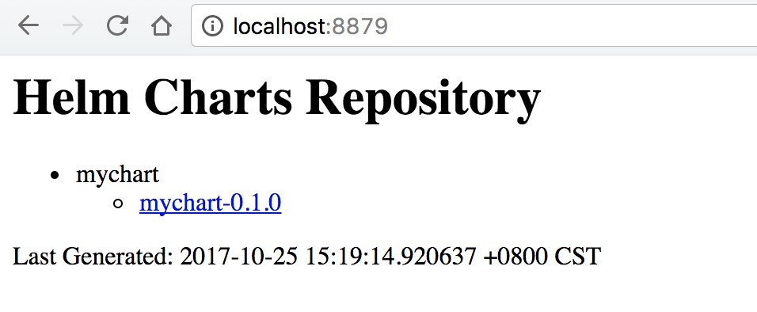
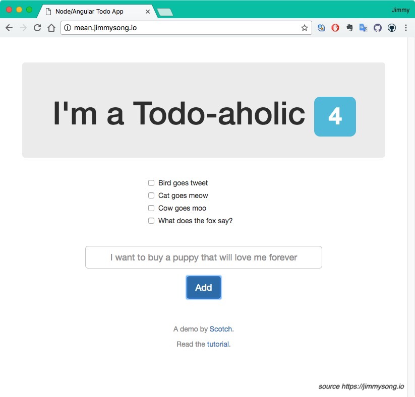

# 使用Helm管理kubernetes应用

读完本文后您应该可以自己创建chart，并创建自己的私有chart仓库。

[Helm](http://helm.sh)是一个kubernetes应用的包管理工具，用来管理[charts](https://github.com/kubernetes/charts)——预先配置好的安装包资源，有点类似于Ubuntu的APT和CentOS中的yum。

Helm chart是用来封装kubernetes原生应用程序的yaml文件，可以在你部署应用的时候自定义应用程序的一些metadata，便与应用程序的分发。

Helm和charts的主要作用：

- 应用程序封装
- 版本管理
- 依赖检查
- 便于应用程序分发

## 安装Helm

**前提要求**

- Kubernetes1.5以上版本
- 集群可访问到的镜像仓库
- 执行helm命令的主机可以访问到kubernetes集群

**安装步骤**

首先需要安装helm客户端

```bash
curl https://raw.githubusercontent.com/kubernetes/helm/master/scripts/get > get_helm.sh
chmod 700 get_helm.sh
./get_helm.sh
```

创建tiller的`serviceaccount`和`clusterrolebinding`

```bash
kubectl create serviceaccount --namespace kube-system tiller
kubectl create clusterrolebinding tiller-cluster-rule --clusterrole=cluster-admin --serviceaccount=kube-system:tiller
```

然后安装helm服务端tiller

```bash
helm init -i jimmysong/kubernetes-helm-tiller:v2.3.1
```

我们使用`-i`指定自己的镜像，因为官方的镜像因为某些原因无法拉取，官方镜像地址是：`gcr.io/kubernetes-helm/tiller:v2.3.1`，我在DockerHub上放了一个备份`jimmysong/kubernetes-helm-tiller:v2.3.1`，该镜像的版本与helm客户端的版本相同，使用`helm version`可查看helm客户端版本。

为应用程序设置`serviceAccount`：

```bash
kubectl patch deploy --namespace kube-system tiller-deploy -p '{"spec":{"template":{"spec":{"serviceAccount":"tiller"}}}}'
```

检查是否安装成功：

```bash
$ kubectl -n kube-system get pods|grep tiller
tiller-deploy-2372561459-f6p0z         1/1       Running   0          1h
$ helm version
Client: &version.Version{SemVer:"v2.3.1", GitCommit:"32562a3040bb5ca690339b9840b6f60f8ce25da4", GitTreeState:"clean"}
Server: &version.Version{SemVer:"v2.3.1", GitCommit:"32562a3040bb5ca690339b9840b6f60f8ce25da4", GitTreeState:"clean"}
```

## 创建自己的chart

我们创建一个名为`mychart`的chart，看一看chart的文件结构。

```bash
$ helm create mongodb
$ tree mongodb
mongodb
├── Chart.yaml #Chart本身的版本和配置信息
├── charts #依赖的chart
├── templates #配置模板目录
│   ├── NOTES.txt #helm提示信息
│   ├── _helpers.tpl #用于修改kubernetes objcet配置的模板
│   ├── deployment.yaml #kubernetes Deployment object
│   └── service.yaml #kubernetes Serivce
└── values.yaml #kubernetes object configuration

2 directories, 6 files
```

### 模板

`Templates`目录下是yaml文件的模板，遵循[Go template](https://golang.org/pkg/text/template/)语法。使用过[Hugo](https://gohugo.io)的静态网站生成工具的人应该对此很熟悉。

我们查看下`deployment.yaml`文件的内容。

```yaml
apiVersion: extensions/v1beta1
kind: Deployment
metadata:
  name: {{ template "fullname" . }}
  labels:
    chart: "{{ .Chart.Name }}-{{ .Chart.Version | replace "+" "_" }}"
spec:
  replicas: {{ .Values.replicaCount }}
  template:
    metadata:
      labels:
        app: {{ template "fullname" . }}
    spec:
      containers:
      - name: {{ .Chart.Name }}
        image: "{{ .Values.image.repository }}:{{ .Values.image.tag }}"
        imagePullPolicy: {{ .Values.image.pullPolicy }}
        ports:
        - containerPort: {{ .Values.service.internalPort }}
        livenessProbe:
          httpGet:
            path: /
            port: {{ .Values.service.internalPort }}
        readinessProbe:
          httpGet:
            path: /
            port: {{ .Values.service.internalPort }}
        resources:
{{ toyaml .Values.resources | indent 12 }}
```

这是该应用的Deployment的yaml配置文件，其中的双大括号包扩起来的部分是Go template，其中的Values是在`values.yaml`文件中定义的：

```yaml
# Default values for mychart.
# This is a yaml-formatted file.
# Declare variables to be passed into your templates.
replicaCount: 1
image:
  repository: nginx
  tag: stable
  pullPolicy: IfNotPresent
service:
  name: nginx
  type: ClusterIP
  externalPort: 80
  internalPort: 80
resources:
  limits:
    cpu: 100m
    memory: 128Mi
  requests:
    cpu: 100m
    memory: 128Mi
```

比如在`Deployment.yaml`中定义的容器镜像`image: "{{ .Values.image.repository }}:{{ .Values.image.tag }}"`其中的：

- `.Values.image.repository`就是nginx
- `.Values.image.tag`就是stable

以上两个变量值是在create chart的时候自动生成的默认值。

我们将默认的镜像地址和tag改成我们自己的镜像`sz-pg-oam-docker-hub-001.tendcloud.com/library/nginx:1.9`。

### 检查配置和模板是否有效

当使用kubernetes部署应用的时候实际上讲templates渲染成最终的kubernetes能够识别的yaml格式。

使用`helm install --dry-run --debug <chart_dir>`命令来验证chart配置。该输出中包含了模板的变量配置与最终渲染的yaml文件。

```bash
$ helm install --dry-run --debug mychart
Created tunnel using local port: '58406'
SERVER: "localhost:58406"
CHART PATH: /Users/jimmy/Workspace/github/bitnami/charts/incubator/mean/charts/mychart
NAME:   filled-seahorse
REVISION: 1
RELEASED: Tue Oct 24 18:57:13 2017
CHART: mychart-0.1.0
USER-SUPPLIED VALUES:
{}

COMPUTED VALUES:
image:
  pullPolicy: IfNotPresent
  repository: sz-pg-oam-docker-hub-001.tendcloud.com/library/nginx
  tag: 1.9
replicaCount: 1
resources:
  limits:
    cpu: 100m
    memory: 128Mi
  requests:
    cpu: 100m
    memory: 128Mi
service:
  externalPort: 80
  internalPort: 80
  name: nginx
  type: ClusterIP

HOOKS:
MANIFEST:

---
# Source: mychart/templates/service.yaml
apiVersion: v1
kind: Service
metadata:
  name: filled-seahorse-mychart
  labels:
    chart: "mychart-0.1.0"
spec:
  type: ClusterIP
  ports:
  - port: 80
    targetPort: 80
    protocol: TCP
    name: nginx
  selector:
    app: filled-seahorse-mychart

---
# Source: mychart/templates/deployment.yaml
apiVersion: extensions/v1beta1
kind: Deployment
metadata:
  name: filled-seahorse-mychart
  labels:
    chart: "mychart-0.1.0"
spec:
  replicas: 1
  template:
    metadata:
      labels:
        app: filled-seahorse-mychart
    spec:
      containers:
      - name: mychart
        image: "sz-pg-oam-docker-hub-001.tendcloud.com/library/nginx:1.9"
        imagePullPolicy: IfNotPresent
        ports:
        - containerPort: 80
        livenessProbe:
          httpGet:
            path: /
            port: 80
        readinessProbe:
          httpGet:
            path: /
            port: 80
        resources:
            limits:
              cpu: 100m
              memory: 128Mi
            requests:
              cpu: 100m
              memory: 128Mi
```

我们可以看到Deployment和Service的名字前半截由两个随机的单词组成，最后才是我们在`values.yaml`中配置的值。

### 部署到kubernetes

在`mychart`目录下执行下面的命令将nginx部署到kubernetes集群上。

```bash
helm install .
NAME:   eating-hound
LAST DEPLOYED: Wed Oct 25 14:58:15 2017
NAMESPACE: default
STATUS: DEPLOYED

RESOURCES:
==> v1/Service
NAME                  CLUSTER-IP     EXTERNAL-IP  PORT(S)  AGE
eating-hound-mychart  10.254.135.68  <none>       80/TCP   0s

==> extensions/v1beta1/Deployment
NAME                  DESIRED  CURRENT  UP-TO-DATE  AVAILABLE  AGE
eating-hound-mychart  1        1        1           0          0s


NOTES:
1. Get the application URL by running these commands:
  export POD_NAME=$(kubectl get pods --namespace default -l "app=eating-hound-mychart" -o jsonpath="{.items[0].metadata.name}")
  echo "Visit http://127.0.0.1:8080 to use your application"
  kubectl port-forward $POD_NAME 8080:80
```

现在nginx已经部署到kubernetes集群上，本地执行提示中的命令在本地主机上访问到nginx实例。

```bash
export POD_NAME=$(kubectl get pods --namespace default -l "app=eating-hound-mychart" -o jsonpath="{.items[0].metadata.name}")
echo "Visit http://127.0.0.1:8080 to use your application"
kubectl port-forward $POD_NAME 8080:80
```

在本地访问`http://127.0.0.1:8080`即可访问到nginx。

**查看部署的relaese**

```bash
$ helm list
NAME        	REVISION	UPDATED                 	STATUS  	CHART        	NAMESPACE
eating-hound	1       	Wed Oct 25 14:58:15 2017	DEPLOYED	mychart-0.1.0	default
```

**删除部署的release**

```bash
$ helm delete eating-hound
release "eating-hound" deleted
```

### 打包分享

我们可以修改`Chart.yaml`中的helm chart配置信息，然后使用下列命令将chart打包成一个压缩文件。

```bash
helm package .
```

打包出`mychart-0.1.0.tgz`文件。

### 依赖

我们可以在`requirement.yaml`中定义应用所依赖的chart，例如定义对`mariadb`的依赖：

```yaml
dependencies:
- name: mariadb
  version: 0.6.0
  repository: https://kubernetes-charts.storage.googleapis.com
```

使用`helm lint . `命令可以检查依赖和模板配置是否正确。

### 安装源

我们在前面安装chart可以通过HTTP server的方式提供。

```bash
$ helm serve
Regenerating index. This may take a moment.
Now serving you on 127.0.0.1:8879
```

访问`http://localhost:8879`可以看到刚刚安装的chart。



点击链接即可以下载chart的压缩包。

## 注意事项

下面列举一些常见问题，和在解决这些问题时候的注意事项。

### 服务依赖管理

所有使用helm部署的应用中如果没有特别指定chart的名字都会生成一个随机的`Release name`，例如`romping-frog`、`sexy-newton`等，跟启动docker容器时候容器名字的命名规则相同，而真正的资源对象的名字是在YAML文件中定义的名字，我们成为`App name`，两者连接起来才是资源对象的实际名字：`Release name`-`App name`。

而使用helm chart部署的包含依赖关系的应用，都会使用同一套`Release name`，在配置YAML文件的时候一定要注意在做服务发现时需要配置的服务地址，如果使用环境变量的话，需要像下面这样配置。

```yaml
env:
 - name: SERVICE_NAME
   value: "{{ .Release.Name }}-{{ .Values.image.env.SERVICE_NAME }}"
```

这是使用了Go template的语法。至于`{{ .Values.image.env.SERVICE_NAME }}`的值是从`values.yaml`文件中获取的，所以需要在`values.yaml`中增加如下配置：

```yaml
image:
  env:
    SERVICE_NAME: k8s-app-monitor-test
```

### 解决本地chart依赖

在本地当前chart配置的目录下启动helm server，我们不指定任何参数，直接使用默认端口启动。

```bash
helm serve
```

将该repo加入到repo list中。

```bash
helm repo add local http://localhost:8879
```

在浏览器中访问<http://localhost:8879>可以看到所有本地的chart。

然后下载依赖到本地。

```bash
helm dependency update
```

这样所有的chart都会下载到本地的`charts`目录下。

### 设置helm命令自动补全

为了方便helm命令的使用，helm提供了自动补全功能，如果使用zsh请执行：

```bash
source <(helm completion zsh)
```

如果使用bash请执行：

```bash
source <(helm completion bash)
```

## 部署MEAN测试案例

MEAN是用来构建网站和web应用的免费开源的JavaScript软件栈，该软件栈包括MongoDB、Express.js、Angular和Node.js。

**下载charts**

```bash
$ git clone https://github.com/bitnami/charts.git
$ cd charts/incubator/mean
$ helm dep list
NAME   	VERSION	REPOSITORY                                       	STATUS
mongodb	0.4.x  	https://kubernetes-charts.storage.googleapis.com/	missing
```

缺少mongodb的依赖，需要更新一下chart。

**注**：`https://kubernetes-charts.storage.googleapis.com/`是Google维护的chart库，访问该地址可以看到所有的chart列表。

```bash
$ helm dep update
Hang tight while we grab the latest from your chart repositories...
...Unable to get an update from the "local" chart repository (http://127.0.0.1:8879/charts):
	Get http://127.0.0.1:8879/charts/index.yaml: dial tcp 127.0.0.1:8879: getsockopt: connection refused
...Successfully got an update from the "stable" chart repository
Update Complete. ⎈Happy Helming!⎈
Saving 1 charts
Downloading mongodb from repo https://kubernetes-charts.storage.googleapis.com/
```

所有的image都在 `values.yaml` 文件中配置。

下载缺失的chart。

```bash
$ helm dep build
Hang tight while we grab the latest from your chart repositories...
...Unable to get an update from the "local" chart repository (http://127.0.0.1:8879/charts):
	Get http://127.0.0.1:8879/charts/index.yaml: dial tcp 127.0.0.1:8879: getsockopt: connection refused
...Successfully got an update from the "stable" chart repository
Update Complete. ⎈Happy Helming!⎈
Saving 1 charts
Downloading mongodb from repo https://kubernetes-charts.storage.googleapis.com/
```

**修改mongodb chart配置**

将刚才下载的`charts/mongodb-0.4.17.tgz`给解压后，修改其中的配置：

- 将`persistence`下的`enabled`设置为false
- 将image修改为我们的私有镜像：sz-pg-oam-docker-hub-001.tendcloud.com/library/bitnami-mongodb:3.4.9-r1

执行`helm install --dry-run --debug .`确定模板无误。

将修改后的mongodb chart打包，在mongodb的目录下执行：

```bash
helm package .
```

现在再访问前面启动的helm server `http://localhost:8879`将可以在页面上看到mongodb-0.4.17这个chart。

我们对官方chart配置做了如下修改后推送到了自己的chart仓库：

- `requirements.yaml`和`requirements.lock`文件中的`repository`为`http://localhost:8879`
- 将`values.yaml`中的`storageClass`设置为`null`
- 将`values.yaml`中的`Image`都改为私有镜像
- `repositroy`都设置为`http://localhost:8879`

**注**：因为我们没有使用PVC所以将所有的关于持久化存储的配置都设置为false了。

**部署MEAN**

在`mean`目录下执行：

```bash
helm install .
NAME:   orbiting-platypus
LAST DEPLOYED: Wed Oct 25 16:21:48 2017
NAMESPACE: default
STATUS: DEPLOYED

RESOURCES:
==> v1/Secret
NAME                       TYPE    DATA  AGE
orbiting-platypus-mongodb  Opaque  2     2s

==> v1/ConfigMap
NAME                    DATA  AGE
orbiting-platypus-mean  1     2s

==> v1/Service
NAME                       CLUSTER-IP      EXTERNAL-IP  PORT(S)    AGE
orbiting-platypus-mongodb  10.254.144.208  <none>       27017/TCP  2s
orbiting-platypus-mean     10.254.165.23   <none>       80/TCP     2s

==> extensions/v1beta1/Deployment
NAME                       DESIRED  CURRENT  UP-TO-DATE  AVAILABLE  AGE
orbiting-platypus-mean     1        1        1           0          2s
orbiting-platypus-mongodb  1        1        1           0          2s


NOTES:

Get the URL of your Node app  by running:

  export POD_NAME=$(kubectl get pods --namespace default -l "app=orbiting-platypus-mean" -o jsonpath="{.items[0].metadata.name}")
  echo http://127.0.0.1:8080/
  kubectl port-forward $POD_NAME 8080:80
```

这样MEAN软件栈就部署到你的kuberentes集群里面了（默认是在default namespace下）。

**验证检查**

为了验证MEAN是否安装成功过，可以使用`kubectl get pods`查看pod是否启动完成，会先启动mongodb的pod，然后启动MEAN中的4步init。

**访问Web UI**

在Ingress中增加如下配置：

```yaml
  - host: mean.jimmysong.io
    http:
      paths:
      - backend:
          serviceName: orbiting-platypus-mean
          servicePort: 80
        path: /
```

然后在页面中更新ingress:

```bash
kubectl repalce -f ingress.yaml
```

关于Ingress配置请参考：[边缘节点配置](../practice/edge-node-configuration.md)

然后在本地的`/etc/hosts`文件中增加一条配置：

```Ini
172.20.0.119 mean.jimmysong.io
```

**注**：172.20.0.119即边缘节点的VIP。

因为该页面需要加载google的angularjs、还有两个css在国内无法访问，可以使用curl测试：

```bash
curl mean.jimmysong.io
```

将会返回HTML内容：

```html
<!doctype html>

<!-- ASSIGN OUR ANGULAR MODULE -->
<html ng-app="scotchTodo">

<head>
    <!-- META -->
    <meta charset="utf-8">
    <meta name="viewport" content="width=device-width, initial-scale=1">
    <!-- Optimize mobile viewport -->

    <title>Node/Angular Todo App</title>

    <!-- SCROLLS -->
    <link rel="stylesheet" href="//netdna.bootstrapcdn.com/bootstrap/3.0.0/css/bootstrap.min.css">
    <!-- load bootstrap -->
    <link rel="stylesheet" href="//netdna.bootstrapcdn.com/font-awesome/4.0.3/css/font-awesome.min.css">
    <style>
        html {
            overflow-y: scroll;
        }
        
        body {
            padding-top: 50px;
        }
        
        #todo-list {
            margin-bottom: 30px;
        }
        
        #todo-form {
            margin-bottom: 50px;
        }
    </style>

    <!-- SPELLS -->
    <script src="//ajax.googleapis.com/ajax/libs/angularjs/1.2.16/angular.min.js"></script>
    <!-- load angular -->

    <script src="js/controllers/main.js"></script>
    <!-- load up our controller -->
    <script src="js/services/todos.js"></script>
    <!-- load our todo service -->
    <script src="js/core.js"></script>
    <!-- load our main application -->

</head>
<!-- SET THE CONTROLLER -->

<body ng-controller="mainController">
    <div class="container">

        <!-- HEADER AND TODO COUNT -->
        <div class="jumbotron text-center">
            <h1>I'm a Todo-aholic <span class="label label-info">{{ todos.length }}</span></h1>
        </div>

        <!-- TODO LIST -->
        <div id="todo-list" class="row">
            <div class="col-sm-4 col-sm-offset-4">


                <!-- LOOP OVER THE TODOS IN $scope.todos -->
                <div class="checkbox" ng-repeat="todo in todos">
                    <label>
						<input type="checkbox" ng-click="deleteTodo(todo._id)"> {{ todo.text }}
					</label>
                </div>

                <p class="text-center" ng-show="loading">
                    <span class="fa fa-spinner fa-spin fa-3x"></span>
                </p>

            </div>
        </div>

        <!-- FORM TO CREATE TODOS -->
        <div id="todo-form" class="row">
            <div class="col-sm-8 col-sm-offset-2 text-center">
                <form>
                    <div class="form-group">

                        <!-- BIND THIS VALUE TO formData.text IN ANGULAR -->
                        <input type="text" class="form-control input-lg text-center" placeholder="I want to buy a puppy that will love me forever" ng-model="formData.text">
                    </div>

                    <!-- createToDo() WILL CREATE NEW TODOS -->
                    <button type="submit" class="btn btn-primary btn-lg" ng-click="createTodo()">Add</button>
                </form>
            </div>
        </div>

        <div class="text-center text-muted">
            <p>A demo by <a href="http://scotch.io">Scotch</a>.</p>
            <p>Read the <a href="http://scotch.io/tutorials/javascript/creating-a-single-page-todo-app-with-node-and-angular">tutorial</a>.</p>
        </div>

    </div>

</body>

</html>
```

访问 http://mean.jimmysong.io 可以看到如下界面，我在其中添加几条todo：



**注**：Todo中的文字来自*What does the fox say？*

测试完成后可以使用下面的命令将mean chart推送的本地chart仓库中。

在mean目录下执行：

```bash
helm package .
```

再次刷新`http://localhost:8879`将可以看到如下三个chart：

- mean
  - mean-0.1.3
- mongodb
  - mongodb-0.4.17
- mychart
  - mychart-0.1.0

## 参考

- [Deploy, Scale And Upgrade An Application On Kubernetes With Helm](https://docs.bitnami.com/kubernetes/how-to/deploy-application-kubernetes-helm/)
- [Helm charts](https://github.com/kubernetes/helm/blob/master/docs/charts.md)
- [Go template](https://golang.org/pkg/text/template/)
- [Helm docs](https://github.com/kubernetes/helm/blob/master/docs/index.md)
- [How To Create Your First Helm Chart](https://docs.bitnami.com/kubernetes/how-to/create-your-first-helm-chart/)
- [Speed deployment on Kubernetes with Helm Chart – Quick yaml example from scratch](https://www.ibm.com/blogs/bluemix/2017/10/quick-example-helm-chart-for-kubernetes/)